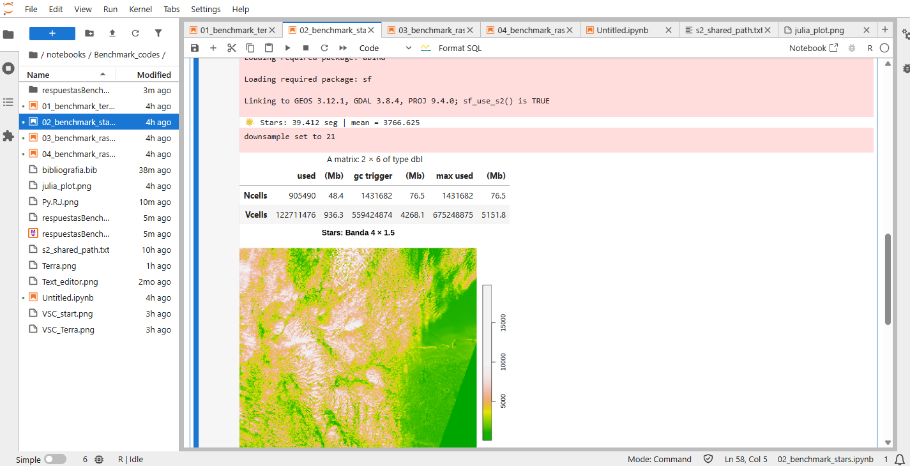
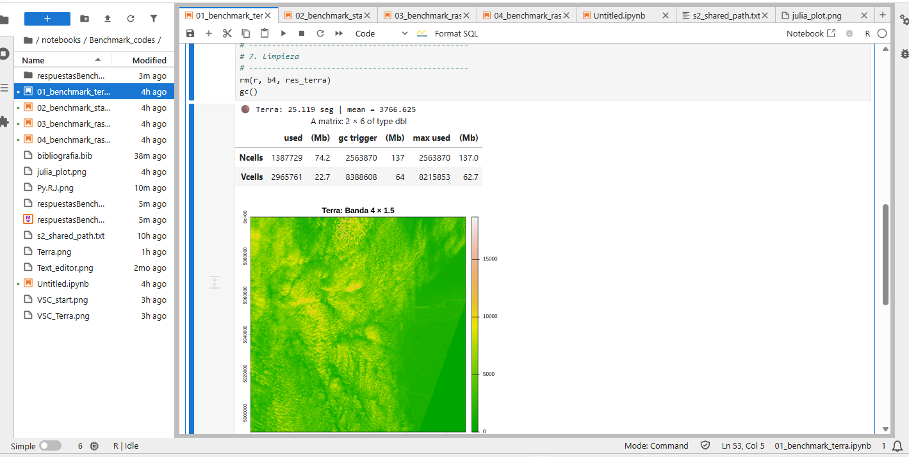
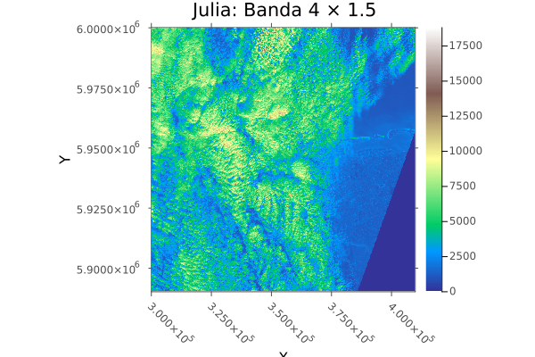
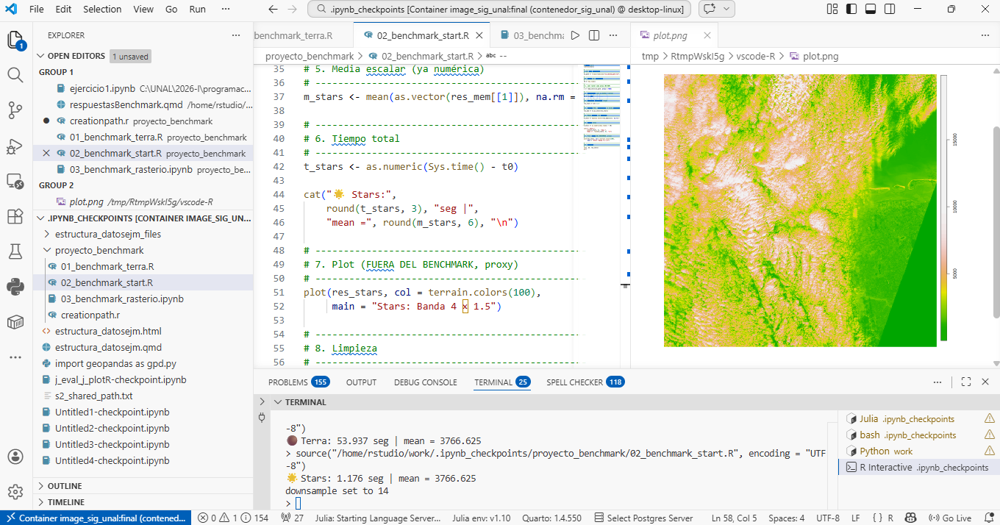
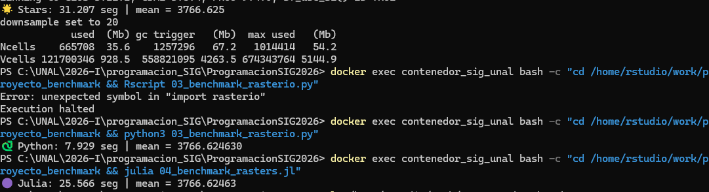
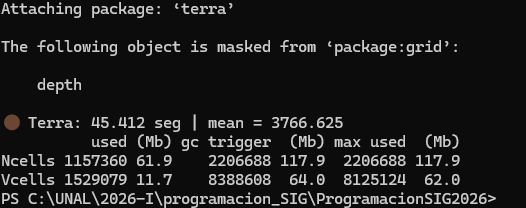

## Introducción

El Benchmark, es una prueba de estandarización, que permite comparar el rendimiento del sistema, al realizar la ejecución de una misma tarea en distintos lenguajes de programación, en este caso en Python, R y Julia. El objetivo es realizar una operación aritmética a una única banda de raster (Banda 4 - Absorción de clorofila 665nm), para entender cuál es el costo computacional de cada lenguaje, y así poder tomar decisiones informadas sobre cuál utilizar en función de las necesidades del proyecto.

## Ejecución de Códigos

### Parte A - Ejecución en Jupyter (notebooks)
La ejecución de los scripts se realizó en un entorno de Jupyter Notebook, utilizando las bibliotecas específicas para cada lenguaje: `rasterio` para Python, `terra` y `stars` para R, y `Raster.jl` para Julia. Cada script fue diseñado para realizar la misma operación aritmética sobre la banda seleccionada del raster, asegurando que las condiciones de prueba fueran equivalentes. 

Se observó que een Notebooks, el lenguaje con menor tiempo fue el de Python con la libreria `rasterio`, con un tiempo de 12.952 seg, seguida de la librería Terra y Starrs de R, para finalmente terminar con el lenguaje de Julia, con un tiempo de 56.159 seg. Lo anterior se observerva mejor en la siguiente gráfica 


```{r}
# Código en R
library(knitr)
library(kableExtra)

#Resultados de los lenguajes
t_python <- 12.952 #seg
t_julia <- 56.159 #seg
t_terra <- 25.119 #seg
t_stars <- 39.412 #seg 

# Creamos el dataframe con los datos capturados
resultados <- data.frame(
  Motor = c("R: terra", "R: stars", "Python: rasterio", "Julia: Rasters.jl"),
  Lenguaje = c("R (C++)", "R", "Python (C++/NumPy)", "Julia (Nativo)"),
  Paralelismo = c("Monohilo", "Monohilo", "SIMD (Vectorizado)", "Multihilo (12 hilos)"),
  Tiempo_Seg = c(t_terra, t_stars, t_python, t_julia)
)
resultados
# Cálculo de eficiencia: ¿Cuántas veces es más rápido que el más lento?
max_t <- max(resultados$Tiempo_Seg, na.rm = TRUE)
resultados$X_mas_rapido <- round(max_t / resultados$Tiempo_Seg, 2)

# Formateo elegante para el HTML
kable(resultados, 
      digits = 3, 
      caption = "Duelo de Titanes: Procesamiento de 1GB Sentinel-2 en JupyterLab Notebooks",
      col.names = c("Motor", "Lenguaje", "Paralelismo", "Tiempo (s)", "Eficiencia (X)")) %>%
  kable_styling(bootstrap_options = c("striped", "hover", "condensed"), 
                full_width = F) %>%
  row_spec(which.min(resultados$Tiempo_Seg), bold = T, color = "white", background = "#2c3e50")

```

Asímismo, se observó con respecto a la generación de imagenes que el único lenguaje que presento problemas desde el Jupyter lab fue Julia, el cual no pudo generar la imagen, mientras que tanto Python como R si pudieron generar la imagen sin problemas.

En las siguientes imágenes se pueden observar los resultados en la interfaz del JupyterLab:

{fig-align="center" width=70%}

{fig-align="center" width=70%}

### Parte B — Ejecución desde VSCode (terminal integrada)

Para VSCode, se crearon además de los archivos soliticitados, uno para la creación del Path y otro con los resultados resumidos. Para este, se obtuvieron los siguientes resultados:

```{r}
#Resultados de los lenguajes
library(knitr)
library(kableExtra)

#Resultados de los lenguajes
t_python <- 15.439 #seg
t_julia <- 56.585 #seg
t_terra <- 57.364 #seg
t_stars <- 1.438 #seg 

# Creamos el dataframe con los datos capturados
resultados <- data.frame(
  Motor = c("R: terra", "R: stars", "Python: rasterio", "Julia: Rasters.jl"),
  Lenguaje = c("R (C++)", "R", "Python (C++/NumPy)", "Julia (Nativo)"),
  Paralelismo = c("Monohilo", "Monohilo", "SIMD (Vectorizado)", "Multihilo (12 hilos)"),
  Tiempo_Seg = c(t_terra, t_stars, t_python, t_julia)
)
resultados
# Cálculo de eficiencia: ¿Cuántas veces es más rápido que el más lento?
max_t <- max(resultados$Tiempo_Seg, na.rm = TRUE)
resultados$X_mas_rapido <- round(max_t / resultados$Tiempo_Seg, 2)

# Formateo elegante para el HTML
kable(resultados, 
      digits = 3, 
      caption = "Duelo de Titanes: Procesamiento de 1GB Sentinel-2 en Visual Studio Code",
      col.names = c("Motor", "Lenguaje", "Paralelismo", "Tiempo (s)", "Eficiencia (X)")) %>%
  kable_styling(bootstrap_options = c("striped", "hover", "condensed"), 
                full_width = F) %>%
  row_spec(which.min(resultados$Tiempo_Seg), bold = T, color = "white", background = "#2c3e50")
```

Observandose qué en ejecución el más rápido fue el lenguaje de R con la librería Stars, seguido de Python con Rasterio, luego R con Terra y finalmente Julia con Rasters.jl. 

La imagen generada por el lenguaje de Julia, que no pudo ser visualizada en JupyterLab, fue la siguiente:

{fig-align="center" width=70%}

Asímismo, la ejecución de códigos en VSCode se vió de la siguiente forma:

{fig-align="center" width=70%}

{fig-align="center" width=70%}

### Parte C — Ejecución desde el Termina de Windows (PowerShell)

A diferencia de VSCode y los Notebooks, no se puede realizar visualización de las imágenes, sin embargo para obtener cálculos y el valor de los tiempos, la terminal es mucho más eficiento, dado que el mayor tiempo fue el empleado por Terra de R, con 45.412. Los valores obtenidos se ven en la siguiente tabla:

```{r}
#Resultados de los lenguajes
library(knitr)
library(kableExtra)

#Resultados de los lenguajes
t_python <- 7.929 #seg
t_julia <- 25.566 #seg
t_terra <- 45.412 #seg
t_stars <- 31.207 #seg 

# Creamos el dataframe con los datos capturados
resultados <- data.frame(
  Motor = c("R: terra", "R: stars", "Python: rasterio", "Julia: Rasters.jl"),
  Lenguaje = c("R (C++)", "R", "Python (C++/NumPy)", "Julia (Nativo)"),
  Paralelismo = c("Monohilo", "Monohilo", "SIMD (Vectorizado)", "Multihilo (12 hilos)"),
  Tiempo_Seg = c(t_terra, t_stars, t_python, t_julia)
)
resultados
# Cálculo de eficiencia: ¿Cuántas veces es más rápido que el más lento?
max_t <- max(resultados$Tiempo_Seg, na.rm = TRUE)
resultados$X_mas_rapido <- round(max_t / resultados$Tiempo_Seg, 2)

# Formateo elegante para el HTML
kable(resultados, 
      digits = 3, 
      caption = "Duelo de Titanes: Procesamiento de 1GB Sentinel-2 en la Terminal",
      col.names = c("Motor", "Lenguaje", "Paralelismo", "Tiempo (s)", "Eficiencia (X)")) %>%
  kable_styling(bootstrap_options = c("striped", "hover", "condensed"), 
                full_width = F) %>%
  row_spec(which.min(resultados$Tiempo_Seg), bold = T, color = "white", background = "#2c3e50")
```

En general, se observa que el lenguaje de Python con Rasterio es el más eficiente en términos de tiempo de ejecución, aplicado desde la terminal y JupyterLab. Mientras que el lenguaje de R con la librería Stars es el más eficiente en términos de tiempo de ejecución, aplicado desde Visual Studio Code. Por otro lado, el lenguaje de Julia con Rasters.jl es el menos eficiente en términos de tiempo de ejecución, aplicado desde JupyterLab y Visual Studio Code. Sin embargo, es importante destacar que los resultados pueden variar dependiendo del entorno de ejecución y la configuración del sistema.

La ejecución del código se visualizó en la terminal de la siguiente forma:

{fig-align="center" width=70%}

{fig-align="center" width=70%}

##  Preguntas de análisis

### Entorno de ejecución

Las principales diferencias en los tiempos de ejecución entre los entornos dependen del flujo de trbajo, no solo del lenguaje de programación empleado, sino también el entorno sobre el cuál se ejecuta. 

Para el caso de la terminal, es el entorno más siliar al sistema operativo, por lo que no requiere de compilación kernels interactivos ni interfases, generando que el flujo de trabajo sea más directo, lo que se traduce en tiempos de ejecución más cortos.

En cuanto al JupyterLab, necesita además de compilarse, generar comunicación con el navegador, generando un aumento en los tiempos. Finalmente, para Visual Studio Code, aunque es un entorno de desarrollo integrado, también requiere de una comunicación con el sistema operativo y la generación de una interfaz gráfica, lo que puede generar tiempos de ejecución más largos en comparación con la terminal.

### Abstracción de la práctica

El costo de las abtracciones es más visible en la libreria de `stars` (R), debido a la manera en la que funciona la libreria, al estar diseñada para datos espaciales multidimensionales, requiere de varias capas, generando un mayor costo administrativo. No trabaja con datos menos complejos como las matrices en `terra`, sino que trabaja con objetos más complejos (cmo bandas, tiempos, variables), lo que puede generar un mayor costo computacional, por lo que presenta tiempos mayores de ejecución con respecto las otras liberias. En contraste, motores como terra o rasterio trabajan más cerca de bibliotecas optimizadas en C/C++ o NumPy, reduciendo el impacto de dichas capas intermedias.

### Julia y el costo de compilación (Warm-up)
**¿El efecto del warm-up de Julia se notó más en algún entorno específico?**
- Expliquen brevemente por qué

Entendiendo el efecto del **warm-up**, como el tiempo adicional para compilación de funciones en su primera ejecución, debido al modelo de compilación que maneja el lenguaje Julia, donde evalua al final, se muestran tiempos muy altos en los entornos de JupyterLab y VSCode, en comparación con la terminal, donde el tiempo fue de 25s. ESto se debe a los procesos de kernel y compilación que se generan en los entornos de JupyterLab y VSCode, lo que puede aumentar significativamente el tiempo de ejecución inicial, mientras que en la terminal, el proceso es más directo y no requiere de la misma cantidad de recursos para la compilación, resultando en tiempos de ejecución más cortos.


### Elección informada
Dependiendo del tipo de proceso que requiera realizar, si elegiría el entorno de ejecución y asímismo el lenguaje. Para cálculos rápidos a menores tiempos, elegiría a Python por su velocidad en resultados y rapidez de ejecución, además de su capacidad de flujos de datos y automatización siendo este un factor clave para la toma de decisiones rápidas.


El anterior ejercicio fue realizado gracias a la guía de la clase de Rodríguez-Avellaneda (2026), de los apartados **Benchmark geoespacial: cómo leer los resultados** y **Evaluación Comparativa de Procesamiento Geoespacial**, además de los resultados obtenidos en la ejecución de los códigos en los diferentes entornos.

## Referencias
Rodríguez-Avellaneda, A. H. (2026). Programación en SIG: R, Python y Julia [Material de curso]. Maestría en Geomática, Universidad Nacional de Colombia. Recuperado de https://github.com/alexyshr/ProgramacionSIG2026